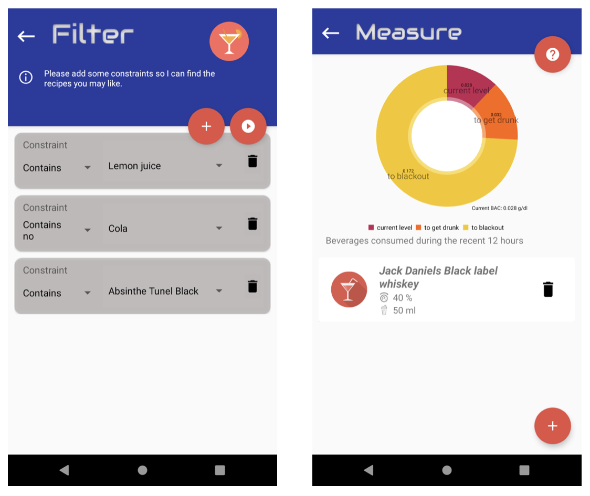
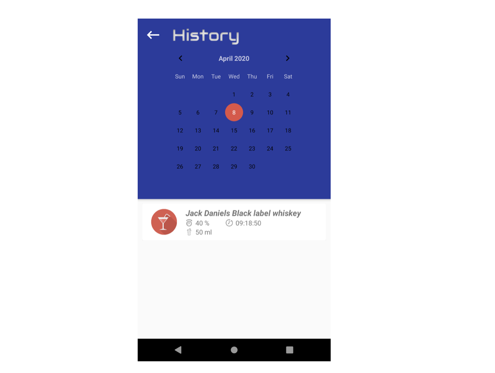

# Mixit
Cocktail recipe management, nightout calendar and blood alcohol meter android java application.

## Functions of the application:
- Storing beverage recipes and ingredients for them
- Filtering the recipes according to the currently available ingredients
- Filtering recipes according to its contents
- Measuring blood alcohol level
- Nightout calendar

## Some screenshots

